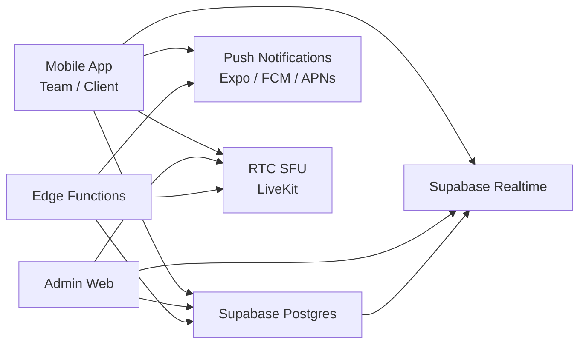
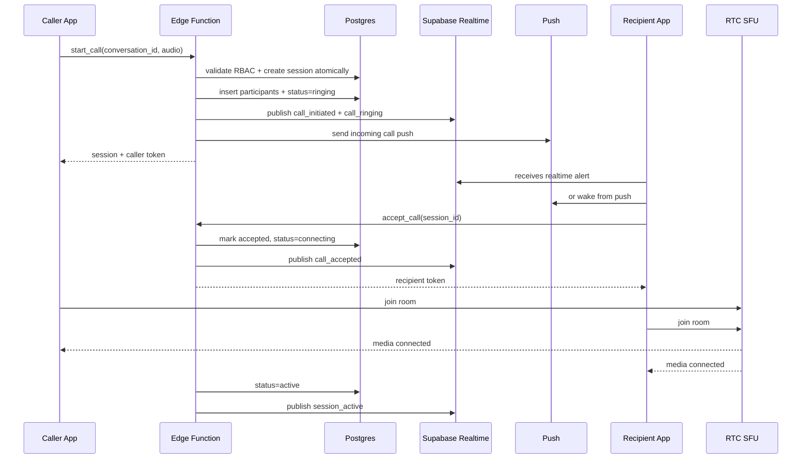
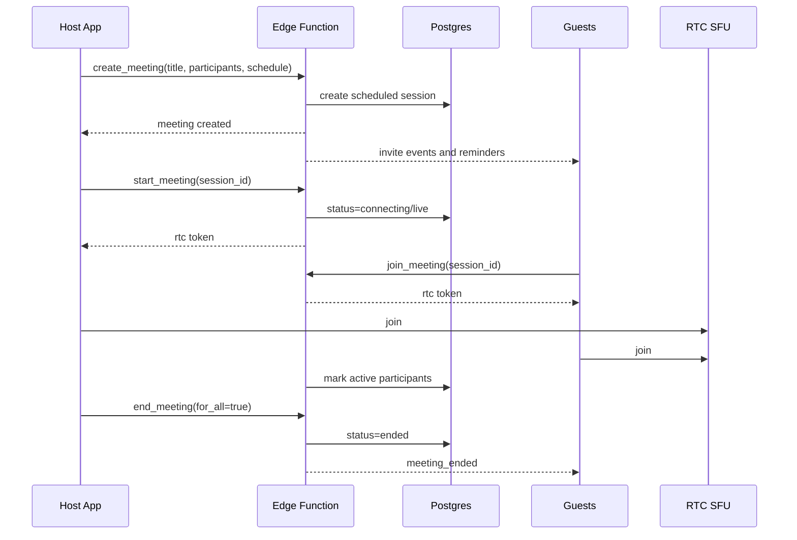

# Primansh Agency OS Communication Layer Design

## 1. Goal

Build a production-grade communication layer for Primansh Agency OS that supports:

- one-to-one voice calls
- group voice calls
- structured video meetings
- deep chat integration
- mobile-first UX
- low-latency and weak-network resilience

This design is grounded in the current codebase:

- chat and meeting orchestration already live in Supabase and the app layer
- role permissions already exist for admin, team, and client
- current meeting rooms use direct WebRTC mesh and Supabase broadcast/presence

## 2. Current Baseline And Upgrade Direction

### What already exists

- Supabase Auth, Postgres, Realtime, and Edge Functions
- role-aware messaging rules in `src/lib/canMessage.ts`
- conversation and message system in `src/hooks/useMessages.ts`
- meeting records, meeting chat, and push token storage in Supabase migrations
- web and mobile room UIs
- current native room implementation in `mobile/app/portal/meetings/room.tsx`
- current web room implementation in `src/app/meeting/page.tsx`

### What must change for production

The current room model is a mesh topology. That is acceptable for prototypes and very small calls, but it does not scale well for:

- group voice calls
- mobile battery efficiency
- larger meetings
- weak network recovery
- adaptive stream management

### Recommended production direction

Use a split architecture:

- Supabase remains the control plane
- an SFU-based RTC provider becomes the media plane

Recommended SFU provider: `LiveKit`

Why:

- mature mobile and web SDKs
- strong audio performance
- server-side active speaker and network quality
- adaptive streaming and dynacast
- participant permissions
- screen sharing and recording support
- simpler scaling than maintaining custom SFU infrastructure now

## 3. High-Level Architecture



### Control plane

Handled by Supabase:

- authentication
- RBAC
- call and meeting records
- invitation state
- realtime state fanout
- event log
- push notification triggers
- post-call history and analytics

### Media plane

Handled by SFU:

- audio/video transport
- NAT traversal
- speaker detection
- quality adaptation
- reconnect and ICE restart
- screen share transport

## 4. Core Product Model

To avoid duplicated logic, use one canonical backend session model and expose two product flavors:

- `Call`: fast, chat-triggered, mostly immediate, voice-first
- `Meeting`: instant or scheduled, structured, host-managed, video-capable

### Canonical session types

- `session_class`: `call` | `meeting`
- `call_type`: `one_to_one` | `group`
- `meeting_type`: `instant` | `scheduled`
- `media_mode`: `audio` | `video`

### Product rules

- one-to-one call: `session_class=call`, `call_type=one_to_one`, `media_mode=audio`
- group voice call: `session_class=call`, `call_type=group`, `media_mode=audio`
- instant meeting: `session_class=meeting`, `meeting_type=instant`, `media_mode=video`
- scheduled meeting: `session_class=meeting`, `meeting_type=scheduled`, `media_mode=video`

## 5. Session State Machine

```text
created
-> inviting
-> ringing
-> connecting
-> active
-> reconnecting
-> ended

terminal side states:
- rejected
- missed
- canceled
- failed
```

### Meaning

- `created`: session record exists, room not yet joined
- `inviting`: participants resolved and notifications dispatched
- `ringing`: recipient devices are being alerted
- `connecting`: at least one participant accepted and is joining media
- `active`: media established
- `reconnecting`: session preserved while device reconnects
- `ended`: session closed for all
- `rejected`: all invitees rejected
- `missed`: no answer before timeout
- `canceled`: initiator ended before answer
- `failed`: token/media startup failed

## 6. Component Design

### 6.1 Signaling system

Use Supabase Realtime for session signaling and state sync, not for media.

Channels:

- `user:{user_id}` for incoming call alerts, cancels, cross-device sync
- `conversation:{conversation_id}` for chat-linked session creation
- `session:{session_id}` for join, leave, mute, hand raise, host actions
- `presence:{session_id}` for lightweight presence and device heartbeat

Rules:

- every event has `event_id`, `session_id`, `actor_id`, `timestamp`, `version`
- clients treat events as idempotent
- server writes canonical status to Postgres
- Realtime is used for low-latency fanout, Postgres is source of truth

### 6.2 Media streaming layer

Use SFU rooms with two room profiles:

- `call-small`: 1:1 and small voice calls
- `meeting-standard`: video meetings, screen share, moderation

Media settings:

- voice calls default to Opus mono, DTX enabled, FEC enabled
- meetings use simulcast for camera tracks
- only subscribe to needed video layers on mobile
- audio is always prioritized over video

### 6.3 Session management

Handled by an Edge Function layer:

- validate RBAC against conversation or invite list
- create or reuse active session atomically
- mint short-lived RTC room token
- send push notifications
- mark invitation states
- close stale ringing sessions

### 6.4 Meeting room system

Meeting rooms support:

- instant start from chat
- scheduled start from meetings module
- lobby preview
- participant roster
- host controls
- meeting chat
- screen sharing

### 6.5 State synchronization

Three sources of truth with clear boundaries:

- Postgres: durable session truth
- Supabase Realtime: fast control/event fanout
- SFU SDK state: media and network quality truth

## 7. Recommended Backend Schema

Use a unified physical schema and expose app-facing `calls` and `meetings` objects through API mapping.

### 7.1 `rtc_sessions`

```sql
id uuid pk
conversation_id uuid null
session_class text check ('call','meeting')
call_type text null check ('one_to_one','group')
meeting_type text null check ('instant','scheduled')
media_mode text check ('audio','video')
title text null
initiator_id uuid not null
host_id uuid null
status text not null
scheduled_start_at timestamptz null
started_at timestamptz null
ended_at timestamptz null
ring_expires_at timestamptz null
room_name text not null
provider text default 'livekit'
recording_enabled boolean default false
screen_share_enabled boolean default true
conversation_message_id uuid null
metadata jsonb default '{}'::jsonb
created_at timestamptz default now()
updated_at timestamptz default now()
```

### 7.2 `rtc_participants`

```sql
id uuid pk
session_id uuid references rtc_sessions(id)
user_id uuid references profiles(id)
session_role text check ('host','moderator','participant')
invite_state text check ('pending','ringing','accepted','rejected','missed','canceled','joined','left','removed')
joined_at timestamptz null
left_at timestamptz null
left_reason text null
device_count int default 0
is_muted boolean default false
is_video_enabled boolean default false
is_hand_raised boolean default false
last_network_quality text null
last_seen_at timestamptz null
metadata jsonb default '{}'::jsonb
unique (session_id, user_id)
```

### 7.3 `rtc_events`

```sql
id uuid pk
session_id uuid references rtc_sessions(id)
participant_id uuid null references rtc_participants(id)
event_type text not null
actor_id uuid null
target_user_id uuid null
payload jsonb default '{}'::jsonb
created_at timestamptz default now()
```

### 7.4 `meeting_schedules`

```sql
id uuid pk
session_id uuid unique references rtc_sessions(id)
agenda text null
reminder_policy jsonb
timezone text
created_at timestamptz default now()
```

### 7.5 `device_push_tokens`

Unify current web push and Expo token models behind one server-facing abstraction:

- `provider`: `expo` | `webpush` | `fcm` | `apns`
- `user_id`
- `device_id`
- `token`
- `last_seen_at`
- `app_state_capabilities`

## 8. Required App Models

### Calls

```json
{
  "id": "uuid",
  "type": "one_to_one | group",
  "initiator": "user_id",
  "participants": ["user_id"],
  "status": "ringing | connecting | active | ended | missed | rejected | canceled",
  "start_time": "timestamp",
  "end_time": "timestamp"
}
```

### Meetings

```json
{
  "id": "uuid",
  "title": "string",
  "created_by": "user_id",
  "participants": ["user_id"],
  "schedule_time": "timestamp",
  "status": "scheduled | live | ended"
}
```

### Participants

```json
{
  "user_id": "uuid",
  "role": "host | moderator | participant",
  "joined_at": "timestamp",
  "left_at": "timestamp"
}
```

## 9. Permission Model

Use the existing Primansh rules as the session authorization source.

### Admin

- can start any call
- can start any meeting
- can join any conversation-linked session
- can mute/remove participants in meetings

### Team

- can call assigned clients and admins
- can start meetings with assigned clients and admins
- can invite only participants allowed by the conversation scope

### Client

- can call assigned team members and admins
- can join only sessions linked to their accessible conversation or direct invite
- cannot invite arbitrary participants outside assignment boundaries

### Enforcement points

- session creation Edge Function
- invite-add API
- RTC token minting function
- RLS on `rtc_sessions`, `rtc_participants`, and `rtc_events`

## 10. Voice Call System Design

## 10.1 One-to-one voice call

Entry points:

- chat header phone icon
- profile quick actions
- recent calls list

Behavior:

- if an active session already exists for the same conversation, show `Join call`
- otherwise create new call session
- push alert and realtime event sent to recipient devices

### One-to-one call flow



### Ringing behavior

- ring timeout: 30 seconds
- if recipient rejects: status `rejected`
- if caller cancels before accept: status `canceled`
- if no answer before timeout: status `missed`
- if recipient has multiple devices, first accept wins and all others receive `call_answered_elsewhere`

## 10.2 Group voice call

Entry points:

- group chat header
- meeting/call action sheet in conversation

Behavior:

- initiator creates audio session linked to group conversation
- all eligible members get a lightweight ring/invite
- late join is allowed while session status is `active`

### Group voice call flow

```text
1. Initiator taps Start voice call in group chat.
2. Backend creates one group call session.
3. All current conversation members are added as pending participants.
4. Online users receive realtime ring; offline users receive push.
5. First two or more accepted users move session to active.
6. Members can join and leave at any time until host or system ends session.
7. Empty-room timeout ends session after grace period.
```

### Group voice behavior

- participant tiles are audio-first, avatar-first
- active speaker highlight from SFU audio levels
- admin/team host can optionally mute others
- raise hand is optional but recommended for groups above 8
- no hard room restart when participants join or leave

## 11. Meeting System Design

## 11.1 Instant meeting

Use when users want a fast Google Meet style room from chat or from the meetings module.

Flow:

1. User taps `Start meeting`.
2. Backend creates meeting session with `meeting_type=instant`.
3. Conversation gets a meeting system message card.
4. Realtime and push notify invitees.
5. Users join lobby, preview camera/mic, then enter room.

## 11.2 Scheduled meeting

Flow:

1. Host creates scheduled meeting with title, date, time, invitees.
2. Backend stores schedule, reminders, and participant list.
3. Chat gets a scheduled meeting card with `Join`, `Add to calendar`, and reminder state.
4. At reminder windows, push and realtime notifications are sent.
5. At start time, host or allowed user starts the live room.

### Scheduled meeting reminder policy

- T minus 15 minutes
- T minus 5 minutes
- at start time

## 11.3 Meeting lifecycle



## 12. Real-Time Event Contract

All events should be versioned and shaped consistently.

```json
{
  "event_id": "uuid",
  "version": 1,
  "type": "call_initiated",
  "session_id": "uuid",
  "conversation_id": "uuid",
  "actor_id": "uuid",
  "target_user_id": "uuid",
  "timestamp": "2026-04-08T12:30:00Z",
  "payload": {}
}
```

### Required events

- `call_initiated`
- `call_ringing`
- `call_accepted`
- `call_rejected`
- `call_ended`
- `user_joined`
- `user_left`
- `meeting_started`
- `meeting_ended`

### Additional production events

- `call_canceled`
- `call_missed`
- `session_connecting`
- `session_active`
- `participant_muted`
- `participant_unmuted`
- `participant_removed`
- `network_quality_changed`
- `reconnect_started`
- `reconnect_succeeded`
- `reconnect_failed`
- `screen_share_started`
- `screen_share_stopped`
- `host_changed`
- `call_answered_elsewhere`

## 13. Backend Logic

## 13.1 Call signaling flow

The backend must own the authoritative transitions.

### `start_call`

- validate conversation access
- ensure target participants are valid under RBAC
- check for active session reuse
- create session atomically if needed
- insert participant rows
- emit `call_initiated` and `call_ringing`
- send push notifications
- mint RTC token for initiator

### `accept_call`

- verify invite exists and has not expired
- mark participant `accepted`
- mark session `connecting` if first accept
- mint RTC token
- emit `call_accepted`

### `reject_call`

- mark participant `rejected`
- if all recipients reject, close session with `rejected`
- emit `call_rejected`

### `end_call`

- if initiator ends before accept, mark `canceled`
- if active session ends, mark `ended`
- close RTC room if last participant leaves or host ends for all
- emit `call_ended`

## 13.2 Session management

Server-side jobs:

- ringing timeout sweeper
- stale reconnect cleanup
- empty room auto-end
- reminder dispatch for scheduled meetings
- analytics aggregation

### Timeouts

- unanswered call timeout: 30 seconds
- reconnect hold window: 45 seconds
- empty active call timeout: 20 seconds
- empty meeting timeout: 2 minutes

## 13.3 Participant synchronization

Participant state comes from merged sources:

- join/leave and invite state from Postgres
- speaking and network quality from SFU callbacks
- app foreground/background from client heartbeats

### Sync rules

- UI reflects optimistic state instantly
- server confirmation resolves final state
- duplicate events are ignored by `event_id`
- out-of-order updates use `version` and `updated_at`

## 13.4 Connection handling

When network drops:

1. client shows `Reconnecting...`
2. RTC SDK attempts ICE restart and fast resume
3. session stays alive during grace window
4. if restored, emit `reconnect_succeeded`
5. if not restored, participant is marked `left` with reason `network_timeout`

## 14. Mobile UX Design

## 14.1 Chat integration

In chat header:

- phone icon for voice call
- video icon for meeting
- overflow for `Schedule meeting`

In chat timeline:

- system message card for ongoing or scheduled sessions
- one-tap `Join`
- show who started it and current status

## 14.2 Incoming call screen

WhatsApp-like behavior:

- full-screen takeover on foreground app
- caller name, avatar, role
- clear `Accept` and `Reject`
- subtle background blur from chat/avatar
- show `Voice call` or `Group voice call`
- if locked/background, rely on push and native call surface where available

Recommended layout:

- top: caller avatar and name
- middle: pulse animation and call type
- bottom: red reject, green accept

## 14.3 Ongoing one-to-one call screen

Voice-first, minimal UI:

- large avatar
- call timer
- connection state text
- mute
- speaker
- end call
- optional bluetooth route picker

Bottom controls must be thumb-friendly and large enough for one-handed use.

## 14.4 Group voice call screen

Telegram-like behavior:

- scrolling participant list
- active speaker highlight
- mute badges
- join and leave without layout break

Layout:

- top: group name, live participant count, timer
- center: stacked participant list with speaking glow
- bottom: mute, speaker, end, optional raise hand

## 14.5 Meeting lobby

Before joining video meeting:

- camera preview
- mic toggle
- camera toggle
- switch camera
- join now button
- device/network status

For voice-only sessions:

- skip heavy lobby
- auto-join after accept

## 14.6 Active meeting screen

Google Meet inspired mobile layout:

- top: meeting title, timer, connection badge
- center: adaptive video grid
- bottom: mute, camera, end, switch camera, more
- modal sheets: participants, chat, settings

### Grid behavior

- 1 user: full screen local or active speaker view
- 2 to 4 users: balanced grid
- 5+ users: paged or scrollable grid
- pinned user or screen share takes main stage

### Bottom controls

- mute / unmute
- camera on / off
- end
- switch camera
- more sheet

More sheet:

- participants
- meeting chat
- raise hand
- screen share
- audio output
- report issue

## 15. Performance Strategy

## 15.1 Low latency

- use regional SFU closest to primary user base
- prefer UDP transport, TURN fallback only when necessary
- prefetch RTC token after accept, not after full room load
- keep signaling payloads tiny

## 15.2 Weak-network resilience

- audio always prioritized over video
- auto-fallback from video to audio-only when bandwidth drops
- adaptive stream layers on video
- subscribe only to visible participants on mobile
- show network quality badge without spamming the UI

## 15.3 Battery efficiency

- no mesh networking beyond prototype mode
- background camera stopped when app backgrounds
- limit decode count on 5+ participant meetings
- stop rendering hidden thumbnails
- use audio-only optimization for voice calls

## 15.4 Fast call connection

- warm up auth/session context when user enters messages tab
- cache recent conversation participant info locally
- prepare push token and presence registration on app boot
- skip lobby for accepted voice calls

## 16. Edge Cases

### Simultaneous call starts

- use atomic server RPC or transaction
- return existing active session if one already exists for the conversation

### Caller hangs up while recipient is ringing

- emit `call_canceled`
- dismiss incoming UI immediately

### Recipient answers on another device

- emit `call_answered_elsewhere`
- close ringing UI on all other devices

### App backgrounding

- keep audio active if OS policy and native module allow
- downgrade meeting UI state to background-safe mode
- show return-to-call affordance when foregrounded again

### Phone interruption

- if GSM/OS call interrupts, pause local mic
- attempt resume when interruption ends
- if not recoverable, mark left reason accordingly

### Wi-Fi to mobile handoff

- do not destroy session immediately
- show reconnecting state
- preserve controls and timer during grace window

### Empty room

- group voice call ends quickly when last user leaves
- scheduled meeting may stay alive for a short host grace period

### Unauthorized invite attempt

- reject server-side
- log audit event
- no client-side-only trust

## 17. Security Design

### Authentication

- only authenticated users can create or join sessions
- RTC access tokens are short-lived and minted per user per session

### Authorization

- token minting checks conversation membership or explicit meeting invite
- room name is never enough to join
- host controls require server-validated permissions

### Transport security

- media uses DTLS-SRTP through the RTC provider
- signaling uses authenticated Supabase channels

### Important note

This design provides transport encryption, not true end-to-end encrypted SFU media by default. If strict E2EE becomes a product requirement later, add SFrame/E2EE as a phase-two enhancement.

## 18. Scalability Plan

### Why SFU is required

Mesh topology grows badly:

- upload cost increases per participant
- mobile CPU and battery drain increase sharply
- group calls become unstable quickly

SFU keeps each client to one upstream and a controlled set of downstream subscriptions.

### Scale targets

- many concurrent 1:1 calls
- many small group voice rooms
- moderate-sized client/team meetings

### Backend scaling strategy

- Postgres stores durable session state
- Realtime only fans out control events
- SFU cluster handles media independently
- background jobs handle reminders and stale cleanup

## 19. Rollout Plan

### Phase 1

- keep current chat and RBAC model
- introduce unified `rtc_sessions` and `rtc_participants`
- move media from mesh to SFU
- ship one-to-one voice call

### Phase 2

- group voice calls
- mobile incoming-call full-screen flow
- stronger reconnect handling

### Phase 3

- instant and scheduled meetings
- screen share
- moderator controls
- analytics and quality dashboards

### Phase 4

- native CallKit / Android ConnectionService integration
- optional recording and summaries
- optional E2EE enhancements

## 20. Concrete Recommendations For This Repo

### Keep

- Supabase Auth, Postgres, Realtime, Edge Functions
- existing conversation and role model
- meeting chat concept
- atomic start-or-get-active pattern already used today

### Replace or refactor

- replace direct WebRTC mesh room logic with SFU SDK based rooms
- stop using the current `meetings` table as the only abstraction for every call type
- unify push delivery across Expo and web push

### Suggested implementation mapping

- `src/hooks/useMessages.ts`: keep as chat orchestrator, but call new session APIs
- `mobile/app/(tabs)/messages.tsx`: add direct call and meeting entry actions
- `mobile/app/portal/meetings/room.tsx`: replace manual peer connection mesh with SFU SDK room screen
- `src/app/meeting/page.tsx`: migrate to the same session contract as mobile
- Supabase migrations: add `rtc_sessions`, `rtc_participants`, `rtc_events`
- Edge Functions: add `start-session`, `accept-session`, `reject-session`, `end-session`, `mint-rtc-token`

## 21. Final Product Summary

The cleanest production architecture for Primansh Agency OS is:

- Supabase as the secure control plane
- SFU-based RTC as the media plane
- one unified session model powering both calls and meetings
- chat-first entry points and message-linked join surfaces
- mobile-first screens optimized for voice speed and meeting clarity

This gives the app:

- WhatsApp-like one-to-one voice calling
- Telegram-like dynamic group voice rooms
- Google Meet-like structured meetings
- strong permission enforcement
- low-latency mobile performance
- a realistic path from the current codebase to a production system
